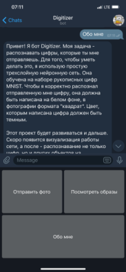
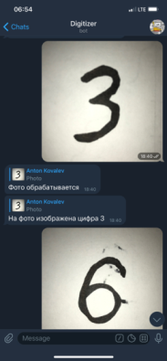

# digitizer - проект по созданию Telegram-бота, который распознает рукописные цифры, используя датасет MNIST

## Структура проекта
Имеется набор данных MNIST, на основе которого, при запуске, бот учится. Затем, после успешного заврешения обучения, запускается основной функционал - обработка запросов от пользователей.

## Как пользоваться
В телеграме найдите бот `Digitizer`

Поприветствуйте его командой `/start`

Вас встретит начальное меню

Чтобы отправить цифру для распознавания, нажмите `Отправить фото`

Чтобы посмотреть, как машина хранит образы цифр, на основе которых и распознает ваши фото, нажмите `Посмотреть образы`. Данные фото получились путем обратного прогона сигналов нейросети.

